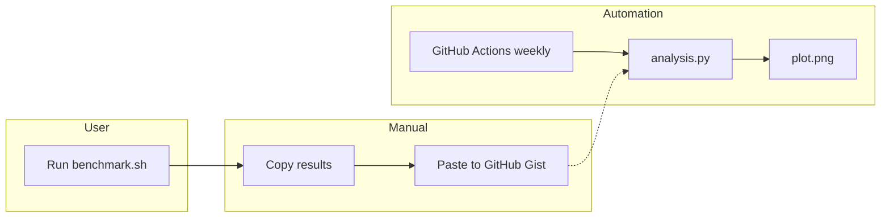
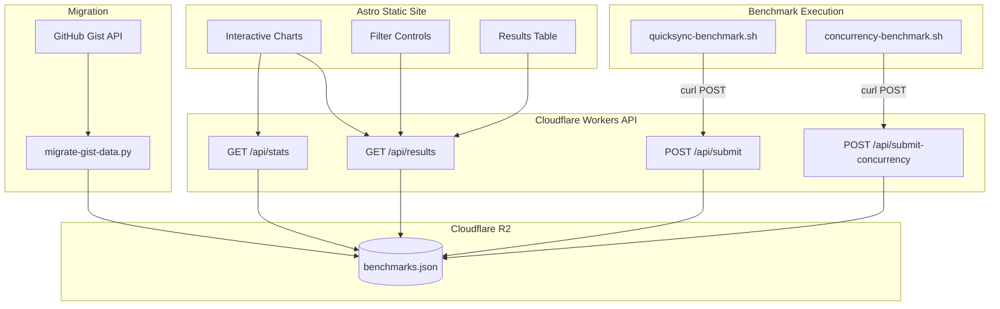
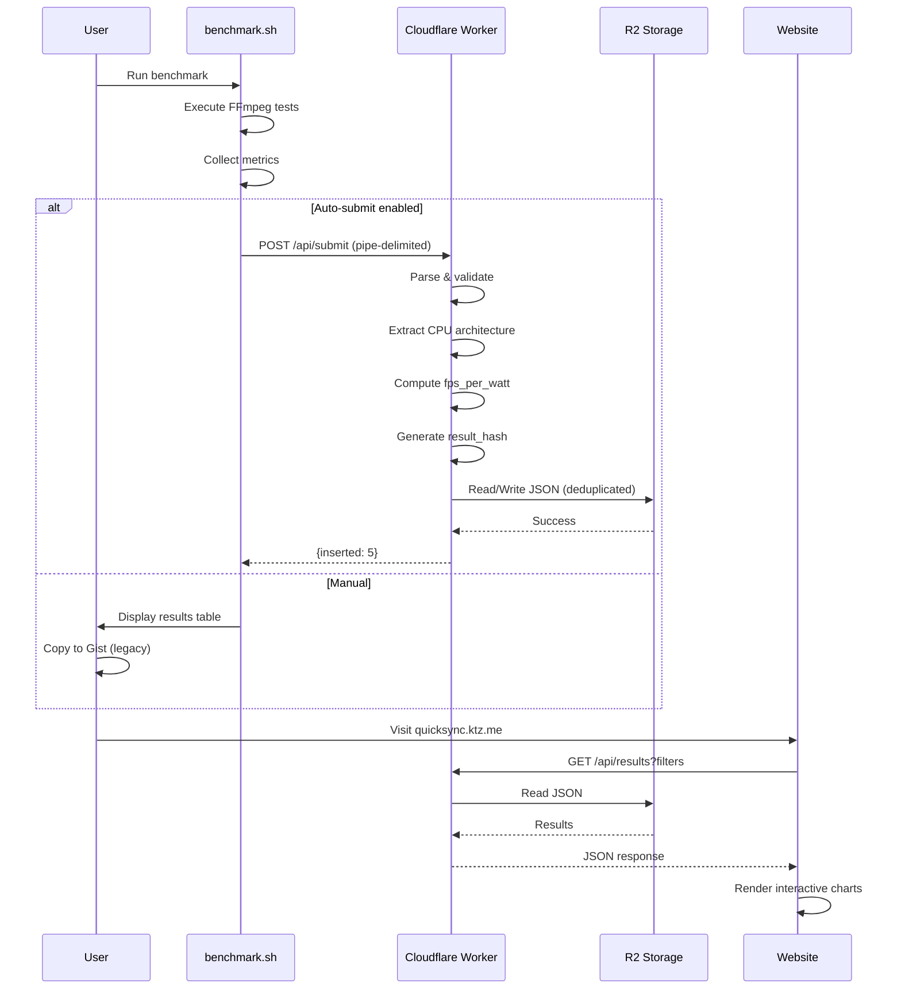
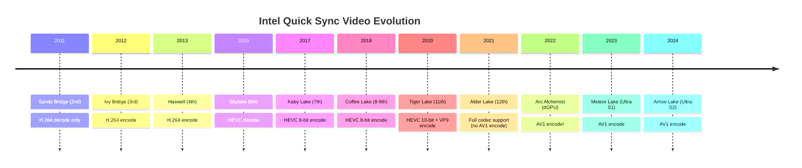
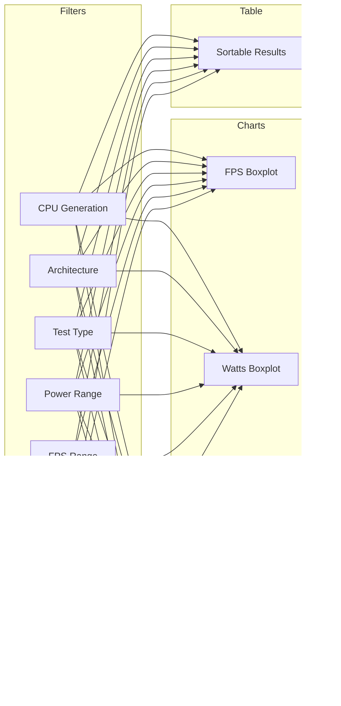
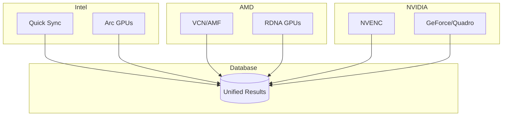
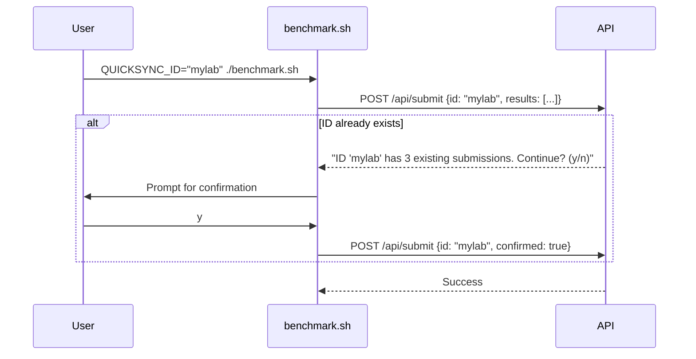

# QuickSync Benchmark - Interactive Website & Database Plan

## GitHub

PRs should be created against `ironicbadger/quicksync_calc` (NOT `cptmorgan-rh`).

## Python

Use `uv` for Python dependency management. Use `uv run --with <package>` to run Python scripts with dependencies without installing them globally.

## Project Overview

Transform the QuickSync Video benchmarking tool from GitHub Gist-based data collection into a modern interactive web application with proper database storage, API submission, and rich visualization.

## Current Architecture



**Problems:**
- Manual copy/paste workflow
- No filtering or interactivity
- Gist comments are hard to query
- Intel's new CPU naming breaks generation parsing

## Proposed Architecture



## Technology Stack

| Component | Technology | Why |
|-----------|------------|-----|
| Storage | Cloudflare R2 | Free tier, global edge, simple JSON storage |
| API | Cloudflare Workers | Free tier, global edge, native R2 support |
| Frontend | Astro + Chart.js | Static-first, interactive charts, simple |
| Hosting | Cloudflare Pages | Free, global CDN, custom domain support |

### Storage: Cloudflare R2

Using Cloudflare R2 with a single JSON file (`benchmarks.json`):

**Why R2:**
- Zero infrastructure to manage
- Global edge distribution
- Simple JSON file format (easy to backup/restore)
- Versioned backups on each write
- No query language needed - just read/write JSON

## Data Flow



## Data Schema

The `benchmarks.json` file stored in R2 contains all data in a single JSON structure:

```typescript
interface BenchmarkData {
  version: number;
  lastUpdated: string;
  meta: {
    totalResults: number;
    uniqueCpus: number;
    architecturesCount: number;
    uniqueTests: number;
  };
  architectures: CpuArchitecture[];
  results: BenchmarkResult[];
  concurrencyResults: ConcurrencyResult[];
  cpuFeatures: Record<string, CpuFeatures>;
}
```

## Intel CPU Architecture Timeline

Intel's naming scheme is now chaotic. We use a lookup table to map CPU strings to architectures.



## Hardware Codec Encoding Support

Source: [Intel Quick Sync Video - Wikipedia](https://en.wikipedia.org/wiki/Intel_Quick_Sync_Video)

| Architecture | Gen | Release | H.264 | HEVC 8-bit | HEVC 10-bit | VP9 | AV1 |
|--------------|-----|---------|-------|------------|-------------|-----|-----|
| Sandy Bridge | 2nd | 2011 | decode | - | - | - | - |
| Ivy Bridge | 3rd | 2012 | **yes** | - | - | - | - |
| Haswell | 4th | 2013 | **yes** | - | - | - | - |
| Skylake | 6th | 2015 | **yes** | decode | - | - | - |
| Kaby/Coffee/Comet | 7-10th | 2016-20 | **yes** | **yes** | - | - | - |
| Ice Lake | 10th | 2019 | **yes** | **yes** | decode | decode | - |
| Tiger Lake | 11th | 2020 | **yes** | **yes** | **yes** | **yes** | decode |
| Rocket/Alder/Raptor | 11-14th | 2021-23 | **yes** | **yes** | **yes** | **yes** | decode |
| Arc Alchemist | dGPU | 2022 | **yes** | **yes** | **yes** | **yes** | **yes** |
| Meteor Lake | Ultra S1 | 2023 | **yes** | **yes** | **yes** | **yes** | **yes** |
| Arrow Lake | Ultra S2 | 2024 | **yes** | **yes** | **yes** | **yes** | **yes** |
| Lunar Lake | Ultra S2 | 2024 | **yes** | **yes** | **yes** | **yes** | **yes** |

## File Structure

```
quicksync_calc/
├── api/                              # Cloudflare Worker
│   ├── wrangler.toml
│   ├── package.json
│   └── src/
│       ├── index.ts                  # Main entry
│       ├── routes/
│       │   ├── submit.ts             # POST /api/submit
│       │   ├── submit-concurrency.ts # POST /api/submit-concurrency
│       │   ├── results.ts            # GET /api/results
│       │   └── stats.ts              # GET /api/stats
│       └── lib/
│           ├── r2.ts                 # R2 storage helpers
│           ├── parser.ts             # Parse pipe-delimited
│           ├── cpu-parser.ts         # Extract CPU info
│           └── validation.ts         # Input validation
│
├── web/                              # Astro static site
│   ├── astro.config.mjs
│   ├── package.json
│   └── src/
│       ├── pages/
│       │   ├── index.astro           # Main dashboard
│       │   └── about.astro           # Instructions
│       ├── components/
│       │   ├── FilterControls.astro
│       │   ├── ResultsTable.astro
│       │   └── charts/
│       │       ├── FpsBoxplot.tsx
│       │       ├── EfficiencyChart.tsx
│       │       └── ConcurrencyHeatmap.tsx
│       └── layouts/
│           └── Layout.astro
│
├── scripts/
│   ├── migrate-gist-data.py          # One-time migration
│   └── seed-architectures.sql        # CPU architecture data
│
├── .github/workflows/
│   ├── results.yaml                  # Existing (keep)
│   └── deploy-web.yaml               # New: deploy website + API
│
├── analysis.py                       # Update to use DB
├── quicksync-benchmark.sh            # Add --submit flag
├── concurrency-quicksync-benchmark.sh # From PR #10
├── CLAUDE.md                         # This file
└── README.md                         # Update docs
```

## Implementation Status

### Completed
- ✅ Cloudflare R2 storage for benchmark data
- ✅ Cloudflare Worker API with submit/results endpoints
- ✅ Astro static site with interactive charts
- ✅ CPU generation pages with architecture details
- ✅ Concurrency benchmark support
- ✅ Cloudflare Pages deployment

## API Endpoints

### POST /api/submit
Submit benchmark results (pipe-delimited format).

```bash
# From benchmark script
printf '%s\n' "${quicksyncstats_arr[@]}" | \
    curl -X POST \
         -H "Content-Type: text/plain" \
         -d @- \
         https://quicksync-api.ktz.me/api/submit
```

**Response:**
```json
{
  "success": true,
  "inserted": 5,
  "skipped": 0,
  "message": "Results submitted successfully"
}
```

### POST /api/submit-concurrency
Submit concurrency test results.

### GET /api/results
Query benchmark results with filters.

```
GET /api/results?generation=12,13&test=hevc_8bit&min_fps=100&limit=100
```

### GET /api/stats
Get aggregated statistics for charts.

```
GET /api/stats?groupBy=architecture&metric=avg_fps
```

## Website Filtering



## PR #10: Concurrency Benchmarks

Open PR adds `concurrency-quicksync-benchmark.sh` which tests maximum simultaneous encodes.

**Output format:**
```
CPU                                      TEST         1x     2x     3x     4x     5x     6x
Intel(R) Core(TM) i5-8500 CPU @ 3.00GHz  h264_1080p   7.02x  4.04x  2.51x  1.86x  1.47x  1.14x
Intel(R) Core(TM) i5-8500 CPU @ 3.00GHz  hevc_8bit    2.43x  1.22x  .80x   -      -      -
```

**Key metric:** Maximum concurrency = highest level maintaining >= 1.0x speed

## Future: Multi-Vendor Support



The `vendor` field in the JSON schema supports this future expansion.

## User Decisions

| Decision | Choice |
|----------|--------|
| Domain | `quicksync.ktz.me` |
| Storage | Cloudflare R2 (JSON file) |
| Authentication | Optional user ID + rate limiting (no OAuth) |
| Gist | Leave untouched |
| Charts | Boxplots + rich filtering |

---

## Privacy & User Identification

Following the [Phoronix/OpenBenchmarking model](https://openbenchmarking.org/features): optional user-provided identifier with soft uniqueness check.

### What We Store

| Field | Stored? | Notes |
|-------|---------|-------|
| CPU model | Yes | Hardware info, not personal data |
| Benchmark metrics | Yes | FPS, watts, speed - technical data |
| Submitter ID | Yes (optional) | User-chosen string, e.g., "alexs_homelab" |
| IP address | **No** | Used transiently for rate limiting only |
| GitHub username | **No** | Not collected |

### Submission Flow



### Implementation

```bash
# Optional: user provides their own identifier
QUICKSYNC_ID="alexs_homelab" QUICKSYNC_SUBMIT=1 ./quicksync-benchmark.sh

# Or run without ID (anonymous submission)
QUICKSYNC_SUBMIT=1 ./quicksync-benchmark.sh
```

API checks for existing submissions with same ID:
- If found: return count and ask user to confirm
- Prevents accidental ID collision
- No enforcement - user can proceed anyway

The `submitter_id` field in the JSON schema is user-provided, optional, and not verified.

### Rate Limiting

- IP addresses used **transiently** for rate limiting (not stored)
- Limit: 10 submissions per IP per hour
- No IP logging in results table

### GDPR Compliance

- **No personal data stored** - CPU model is hardware info, not PII
- **No IP logging** - only transient rate limiting
- **Optional pseudonymous ID** - user-chosen, not verified
- **All results public** - social accountability for spam prevention

---

## References

- [Intel Quick Sync Video - Wikipedia](https://en.wikipedia.org/wiki/Intel_Quick_Sync_Video)
- [Intel Media Capabilities](https://www.intel.com/content/www/us/en/docs/onevpl/developer-reference-media-intel-hardware/1-1/overview.html)
- [Intel Core Ultra Naming](https://www.intel.com/content/www/us/en/support/articles/000097596/processors/intel-core-ultra-processors.html)
- [Cloudflare R2](https://developers.cloudflare.com/r2/)
- [Cloudflare Workers](https://developers.cloudflare.com/workers/)
- [Astro Documentation](https://docs.astro.build/)
