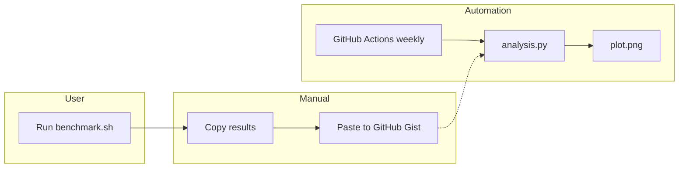
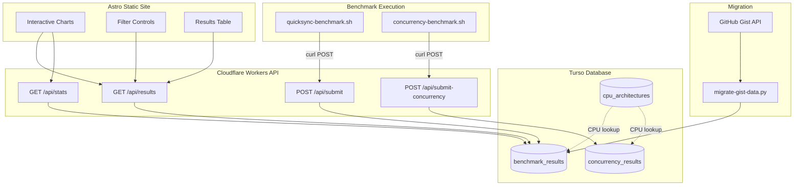
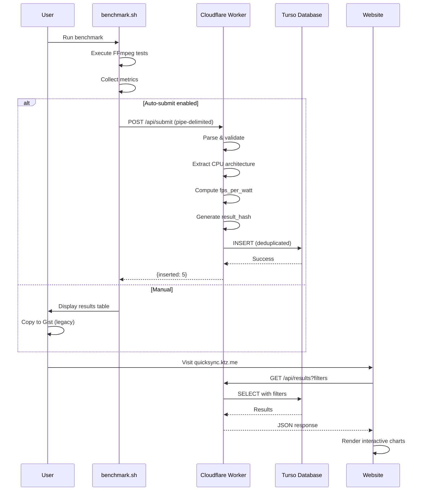
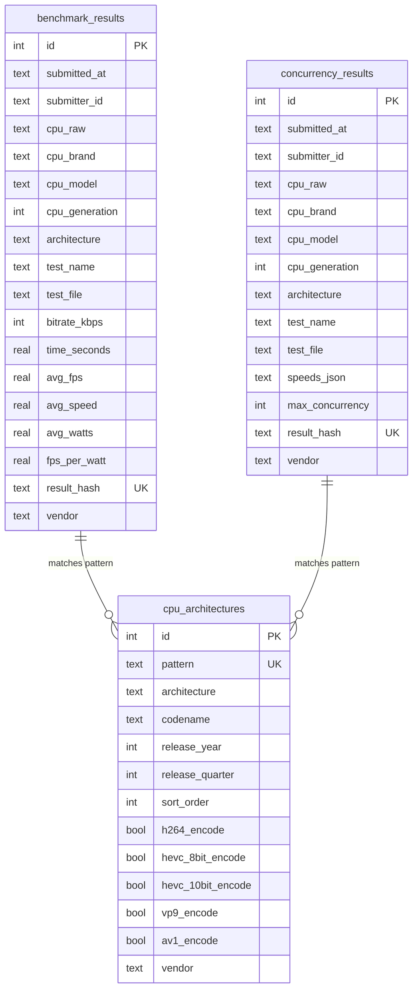
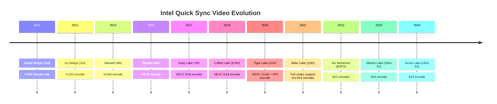
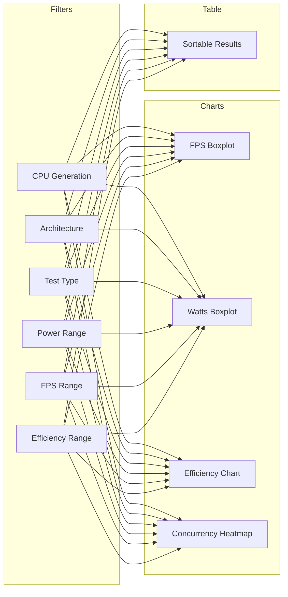
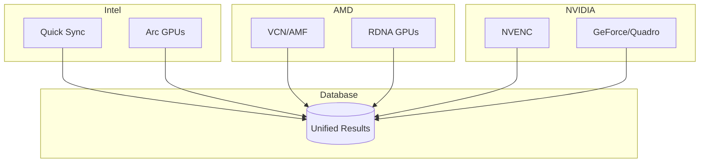
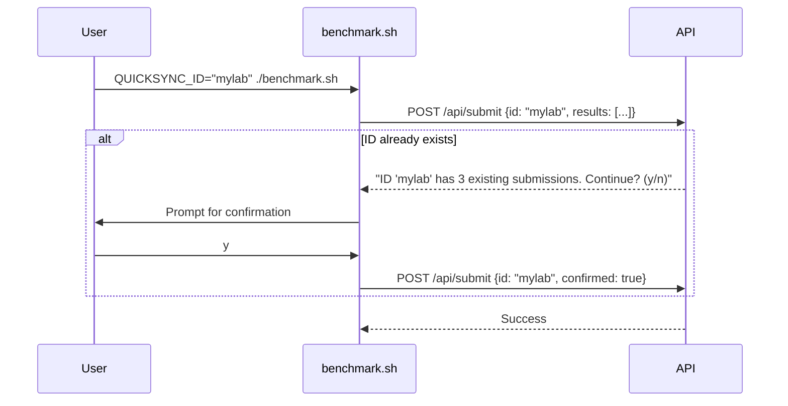

# QuickSync Benchmark - Interactive Website & Database Plan

## Secrets

Turso database credentials are stored in sops. Use `sops` to decrypt and access them.

## Python

Use `uv` for Python dependency management. Use `uv run --with <package>` to run Python scripts with dependencies without installing them globally.

### Turso Database Access

To query Turso database:
```bash
eval $(sops -d secrets.enc.yaml | sed 's/: /=/g' | sed 's/^/export /g')
TURSO_URL="$turso_url" TURSO_AUTH_TOKEN="$turso_auth_token" \
uv run --with libsql-experimental python3 -c "
import libsql_experimental as libsql
import os
conn = libsql.connect(os.environ['TURSO_URL'], auth_token=os.environ['TURSO_AUTH_TOKEN'])
result = conn.execute('SELECT * FROM benchmark_results LIMIT 5')
print(result.fetchall())
"
```

## Project Overview

Transform the QuickSync Video benchmarking tool from GitHub Gist-based data collection into a modern interactive web application with proper database storage, API submission, and rich visualization.

## Current Architecture



**Problems:**
- Manual copy/paste workflow
- No filtering or interactivity
- Gist comments are hard to query
- Intel's new CPU naming breaks generation parsing

## Proposed Architecture



## Technology Stack

| Component | Technology | Why |
|-----------|------------|-----|
| Database | [Turso](https://turso.tech) | Free tier, SQLite-based, edge-ready, global replication |
| API | Cloudflare Workers | Free tier, global edge, native Turso support |
| Frontend | Astro + Chart.js | Static-first, interactive charts, simple |
| Hosting | Cloudflare Pages | Free, global CDN, custom domain support |

### Database: Turso Cloud

Using [Turso](https://turso.tech) (hosted libSQL):

**Free tier includes:**
- 500 databases
- 9 GB storage
- 1 billion row reads/month
- 25 million row writes/month

**Why Turso:**
- Zero infrastructure to manage
- Global edge replication
- SQLite compatibility (easy local dev)
- Simple REST API for curl submissions

**Self-hosted fallback:** If limits are ever hit, can migrate to self-hosted libSQL by:
1. Export: `turso db shell <db> .dump > backup.sql`
2. Run libSQL Docker container
3. Import and change connection URL

```yaml
# Self-hosted option (if ever needed)
services:
  libsql:
    image: ghcr.io/tursodatabase/libsql-server:latest
    ports:
      - "8080:8080"
    volumes:
      - ./data/libsql:/var/lib/sqld
```

## Data Flow



## Database Schema



## Intel CPU Architecture Timeline

Intel's naming scheme is now chaotic. We use a lookup table to map CPU strings to architectures.



## Hardware Codec Encoding Support

Source: [Intel Quick Sync Video - Wikipedia](https://en.wikipedia.org/wiki/Intel_Quick_Sync_Video)

| Architecture | Gen | Release | H.264 | HEVC 8-bit | HEVC 10-bit | VP9 | AV1 |
|--------------|-----|---------|-------|------------|-------------|-----|-----|
| Sandy Bridge | 2nd | 2011 | decode | - | - | - | - |
| Ivy Bridge | 3rd | 2012 | **yes** | - | - | - | - |
| Haswell | 4th | 2013 | **yes** | - | - | - | - |
| Skylake | 6th | 2015 | **yes** | decode | - | - | - |
| Kaby/Coffee/Comet | 7-10th | 2016-20 | **yes** | **yes** | - | - | - |
| Ice Lake | 10th | 2019 | **yes** | **yes** | decode | decode | - |
| Tiger Lake | 11th | 2020 | **yes** | **yes** | **yes** | **yes** | decode |
| Rocket/Alder/Raptor | 11-14th | 2021-23 | **yes** | **yes** | **yes** | **yes** | decode |
| Arc Alchemist | dGPU | 2022 | **yes** | **yes** | **yes** | **yes** | **yes** |
| Meteor Lake | Ultra S1 | 2023 | **yes** | **yes** | **yes** | **yes** | **yes** |
| Arrow Lake | Ultra S2 | 2024 | **yes** | **yes** | **yes** | **yes** | **yes** |
| Lunar Lake | Ultra S2 | 2024 | **yes** | **yes** | **yes** | **yes** | **yes** |

## File Structure

```
quicksync_calc/
├── api/                              # Cloudflare Worker
│   ├── wrangler.toml
│   ├── package.json
│   └── src/
│       ├── index.ts                  # Main entry
│       ├── routes/
│       │   ├── submit.ts             # POST /api/submit
│       │   ├── submit-concurrency.ts # POST /api/submit-concurrency
│       │   ├── results.ts            # GET /api/results
│       │   └── stats.ts              # GET /api/stats
│       └── lib/
│           ├── db.ts                 # Turso client
│           ├── parser.ts             # Parse pipe-delimited
│           ├── cpu-parser.ts         # Extract CPU info
│           └── validation.ts         # Input validation
│
├── web/                              # Astro static site
│   ├── astro.config.mjs
│   ├── package.json
│   └── src/
│       ├── pages/
│       │   ├── index.astro           # Main dashboard
│       │   └── about.astro           # Instructions
│       ├── components/
│       │   ├── FilterControls.astro
│       │   ├── ResultsTable.astro
│       │   └── charts/
│       │       ├── FpsBoxplot.tsx
│       │       ├── EfficiencyChart.tsx
│       │       └── ConcurrencyHeatmap.tsx
│       └── layouts/
│           └── Layout.astro
│
├── scripts/
│   ├── migrate-gist-data.py          # One-time migration
│   └── seed-architectures.sql        # CPU architecture data
│
├── .github/workflows/
│   ├── results.yaml                  # Existing (keep)
│   └── deploy-web.yaml               # New: deploy website + API
│
├── analysis.py                       # Update to use DB
├── quicksync-benchmark.sh            # Add --submit flag
├── concurrency-quicksync-benchmark.sh # From PR #10
├── CLAUDE.md                         # This file
└── README.md                         # Update docs
```

## Implementation Phases

### Phase 1: Database Setup
1. Create Turso account and database
2. Run schema creation SQL
3. Seed `cpu_architectures` table
4. Create migration script for existing gist data

### Phase 2: API Development
1. Initialize Cloudflare Worker project
2. Implement `POST /api/submit` endpoint
3. Implement `POST /api/submit-concurrency` endpoint
4. Implement `GET /api/results` with filtering
5. Implement `GET /api/stats` for chart aggregations
6. Add rate limiting

### Phase 3: Web Frontend
1. Initialize Astro project
2. Build filter controls (generation, test type, power, performance)
3. Create interactive boxplot charts
4. Create concurrency heatmap visualization
5. Build sortable results table

### Phase 4: Integration
1. Add `--submit` flag to `quicksync-benchmark.sh`
2. Merge and update PR #10 concurrency script
3. Update `analysis.py` to read from database
4. Update README with new workflow

### Phase 5: Deployment
1. Create GitHub Actions workflow for deployment
2. Configure Cloudflare Pages
3. Set up custom domain: `quicksync.ktz.me`
4. Add GitHub secrets for Turso credentials

## API Endpoints

### POST /api/submit
Submit benchmark results (pipe-delimited format).

```bash
# From benchmark script
printf '%s\n' "${quicksyncstats_arr[@]}" | \
    curl -X POST \
         -H "Content-Type: text/plain" \
         -d @- \
         https://quicksync-api.ktz.me/api/submit
```

**Response:**
```json
{
  "success": true,
  "inserted": 5,
  "skipped": 0,
  "message": "Results submitted successfully"
}
```

### POST /api/submit-concurrency
Submit concurrency test results.

### GET /api/results
Query benchmark results with filters.

```
GET /api/results?generation=12,13&test=hevc_8bit&min_fps=100&limit=100
```

### GET /api/stats
Get aggregated statistics for charts.

```
GET /api/stats?groupBy=architecture&metric=avg_fps
```

## Website Filtering



## PR #10: Concurrency Benchmarks

Open PR adds `concurrency-quicksync-benchmark.sh` which tests maximum simultaneous encodes.

**Output format:**
```
CPU                                      TEST         1x     2x     3x     4x     5x     6x
Intel(R) Core(TM) i5-8500 CPU @ 3.00GHz  h264_1080p   7.02x  4.04x  2.51x  1.86x  1.47x  1.14x
Intel(R) Core(TM) i5-8500 CPU @ 3.00GHz  hevc_8bit    2.43x  1.22x  .80x   -      -      -
```

**Key metric:** Maximum concurrency = highest level maintaining >= 1.0x speed

## Future: Multi-Vendor Support



Schema preparation:
```sql
ALTER TABLE benchmark_results ADD COLUMN vendor TEXT DEFAULT 'intel';
ALTER TABLE cpu_architectures ADD COLUMN vendor TEXT DEFAULT 'intel';
```

## User Decisions

| Decision | Choice |
|----------|--------|
| Domain | `quicksync.ktz.me` |
| Database | Turso cloud (with self-hosted libSQL fallback) |
| Authentication | Optional user ID + rate limiting (no OAuth) |
| Gist | Leave untouched |
| Charts | Boxplots + rich filtering |

---

## Privacy & User Identification

Following the [Phoronix/OpenBenchmarking model](https://openbenchmarking.org/features): optional user-provided identifier with soft uniqueness check.

### What We Store

| Field | Stored? | Notes |
|-------|---------|-------|
| CPU model | Yes | Hardware info, not personal data |
| Benchmark metrics | Yes | FPS, watts, speed - technical data |
| Submitter ID | Yes (optional) | User-chosen string, e.g., "alexs_homelab" |
| IP address | **No** | Used transiently for rate limiting only |
| GitHub username | **No** | Not collected |

### Submission Flow



### Implementation

```bash
# Optional: user provides their own identifier
QUICKSYNC_ID="alexs_homelab" QUICKSYNC_SUBMIT=1 ./quicksync-benchmark.sh

# Or run without ID (anonymous submission)
QUICKSYNC_SUBMIT=1 ./quicksync-benchmark.sh
```

API checks for existing submissions with same ID:
- If found: return count and ask user to confirm
- Prevents accidental ID collision
- No enforcement - user can proceed anyway

```sql
-- Schema includes optional submitter_id
submitter_id TEXT,  -- User-provided, optional, no verification
```

### Rate Limiting

- IP addresses used **transiently** for rate limiting (not stored in database)
- Limit: 10 submissions per IP per hour
- No IP logging in results table

### GDPR Compliance

- **No personal data stored** - CPU model is hardware info, not PII
- **No IP logging** - only transient rate limiting
- **Optional pseudonymous ID** - user-chosen, not verified
- **All results public** - social accountability for spam prevention

---

## References

- [Intel Quick Sync Video - Wikipedia](https://en.wikipedia.org/wiki/Intel_Quick_Sync_Video)
- [Intel Media Capabilities](https://www.intel.com/content/www/us/en/docs/onevpl/developer-reference-media-intel-hardware/1-1/overview.html)
- [Intel Core Ultra Naming](https://www.intel.com/content/www/us/en/support/articles/000097596/processors/intel-core-ultra-processors.html)
- [Turso Documentation](https://docs.turso.tech/)
- [Cloudflare Workers](https://developers.cloudflare.com/workers/)
- [Astro Documentation](https://docs.astro.build/)
