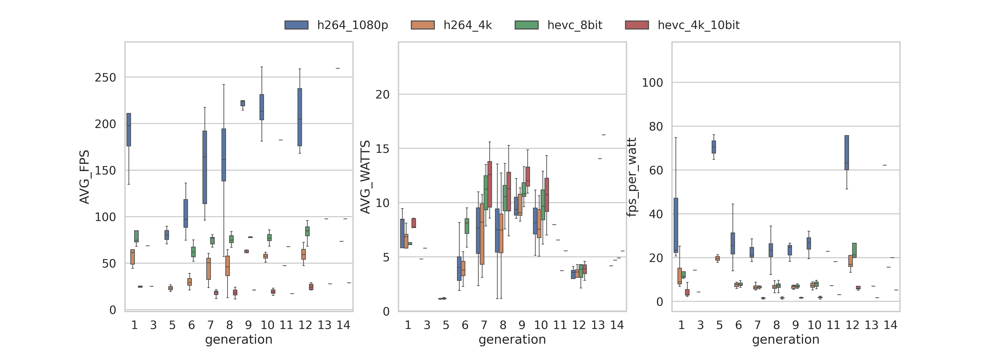

# Intel Quick Sync Video Benchmark

Runs an FFmpeg benchmark to measure Average Speed, FPS, and Power consumption for Intel Quick Sync Video hardware encoding.

## Overview

The purpose of this script is to benchmark Intel Quick Sync Video performance in integrated GPUs using standardized test videos. More information and rationale is available [at blog.ktz.me](https://blog.ktz.me/i-need-your-help-with-intel-quick-sync-benchmarking/).

Some conclusions and analysis has now been performed (May 2024), you can read about it [at blog.ktz.me](https://blog.ktz.me/the-best-media-server-cpu-in-the-world/).

## Interactive Results

View and explore all benchmark results at: **[quicksync.ktz.me](https://quicksync.ktz.me)**

The website provides:
- Interactive charts comparing performance across CPU generations
- Filtering by CPU architecture, test type, power usage, and more
- Efficiency metrics (FPS per Watt)
- Searchable results table

## Requirements

- Docker
- Intel CPU with Quick Sync support
- `intel-gpu-tools` package (for power measurement)
- `jq` (for JSON parsing)
- `awk` (for calculations - typically pre-installed)

Designed for Linux. Tested on Proxmox 9 and Ubuntu 24.04 LTS.

This should be run as root with no other applications/containers running that would utilize Quick Sync. This includes Desktop Environments.

## Results Plot

Here's a plot of all results run to date from the results [Gist](https://gist.github.com/ironicbadger/5da9b321acbe6b6b53070437023b844d) - thanks to [u/Alicimo](https://github.com/Alicimo) for this. It's updated weekly via an automated action.




## How to Use

Full instructions available at [blog.ktz.me](https://blog.ktz.me/i-need-your-help-with-intel-quick-sync-benchmarking/).

```bash
# Connect to the system you want to benchmark (likely via ssh)
# This assume that this user has permissions to execute a privileged docker container
ssh user@hostname

# Install dependencies (tested on Proxmox 8 + Ubuntu 22.04)
apt install docker.io jq intel-gpu-tools git curl

# Clone the repository
git clone https://github.com/ironicbadger/quicksync_calc.git
cd quicksync_calc

# Run the benchmark
./quicksync-benchmark.sh
```

### Submitting Results

You can automatically submit your results to the online database:

```bash
# Run benchmark and submit results
./quicksync-benchmark.sh

# Submit with your own identifier (for filtering your results later)
QUICKSYNC_ID="my_homelab" ./quicksync-benchmark.sh
```

deprecated ~~Alternatively, you can still manually copy results to the [GitHub Gist](https://gist.github.com/ironicbadger/5da9b321acbe6b6b53070437023b844d).~~

## Sample Output

```bash
CPU      TEST            FILE                        BITRATE     TIME      AVG_FPS  AVG_SPEED  AVG_WATTS
i5-9500  h264_1080p_cpu  ribblehead_1080p_h264       18952 kb/s  59.665s   58.03    2.05x      N/A
i5-9500  h264_1080p      ribblehead_1080p_h264       18952 kb/s  15.759s   232.03   7.63x      7.66
i5-9500  h264_4k         ribblehead_4k_h264          46881 kb/s  58.667s   59.21    2.09x      7.49
i5-9500  hevc_8bit       ribblehead_1080p_hevc_8bit  14947 kb/s  45.369s   76.10    2.66x      9.09
i5-9500  hevc_4k_10bit   ribblehead_4k_hevc_10bit    44617 kb/s  176.932s  19.71    .68x       10.12
```

```bash
CPU       TEST            FILE                        BITRATE     TIME      AVG_FPS  AVG_SPEED  AVG_WATTS
i5-8500T  h264_1080p_cpu  ribblehead_1080p_h264       18952 kb/s  87.080s   42.86    1.46x      N/A
i5-8500T  h264_1080p      ribblehead_1080p_h264       18952 kb/s  18.928s   182.45   6.31x      9.09
i5-8500T  h264_4k         ribblehead_4k_h264          46881 kb/s  69.238s   49.52    1.75x      9.04
i5-8500T  hevc_8bit       ribblehead_1080p_hevc_8bit  14947 kb/s  45.061s   76.42    2.67x      11.93
i5-8500T  hevc_4k_10bit   ribblehead_4k_hevc_10bit    44617 kb/s  185.816s  18.85    .65x       13.13
```
