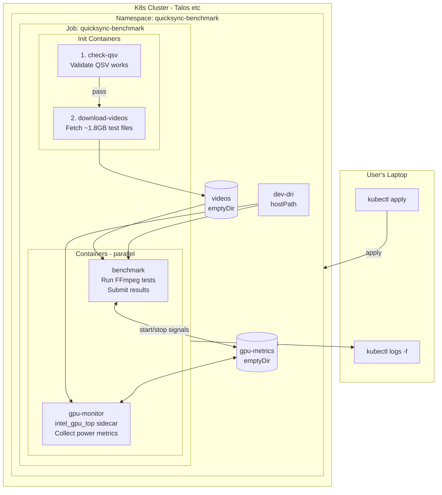

# Kubernetes Support for QuickSync Benchmark

## Overview

Add support for running QuickSync benchmarks on Kubernetes clusters (including Talos) as a one-shot job from a user's laptop with a valid kubeconfig.

## Architecture



## Existing Assets

### docker-intel-gpu-tools

We already have a containerized `intel_gpu_top` at:
- **Repo:** https://github.com/ironicbadger/docker-intel-gpu-tools
- **Image:** `ghcr.io/ironicbadger/docker-intel-gpu-tools`
- **Base:** `debian:bookworm-slim`
- **Usage:** `docker run --rm -it --privileged -v /dev/dri:/dev/dri ghcr.io/ironicbadger/docker-intel-gpu-tools`

This can be used as a sidecar container for power monitoring, or we can extend it for the full benchmark image.

## Key Challenges & Solutions

### 1. Intel GPU Access on Kubernetes

**Challenge:** Quick Sync requires `/dev/dri` access (Intel iGPU)

| Approach | Talos Support | Complexity | Notes |
|----------|---------------|------------|-------|
| Intel GPU Device Plugin | Yes | Medium | Proper resource management |
| Privileged + hostPath | Yes | Low | Simple but less secure |
| Node Feature Discovery | Yes | High | Best for multi-node clusters |

**Recommendation:** Start with privileged + hostPath for simplicity; add GPU plugin docs as optional enhancement.

### 2. Test Video Files (~1.8GB)

| Approach | Pros | Cons |
|----------|------|------|
| Init container download | Simple, always fresh | ~2-5 min startup |
| Pre-built image with videos | Fast startup | 2GB+ image, versioning |
| PVC with pre-populated data | Reusable, fast | Requires cluster storage |

**Recommendation:** Init container download for one-shot usage.

### 3. Power Monitoring with intel_gpu_top

**Options:**

1. **Sidecar container** - Run `ghcr.io/ironicbadger/docker-intel-gpu-tools` alongside benchmark
2. **Include in main image** - Extend Jellyfin image with intel-gpu-tools package
3. **Skip power monitoring** - Simpler, but loses watt metrics

**Recommendation:** Include in main image (option 2) for simplicity, but note that power monitoring may not work in all K8s environments.

## Implementation Plan

### Phase 1: Container Image

Extend Jellyfin with benchmark dependencies:

```dockerfile
# k8s/Dockerfile
FROM docker.io/jellyfin/jellyfin:latest

RUN apt-get update && apt-get install -y --no-install-recommends \
    intel-gpu-tools \
    curl \
    jq \
    bc \
    wget \
    && rm -rf /var/lib/apt/lists/*

COPY quicksync-benchmark.sh /app/
COPY benchmark.sh /app/
COPY video-download.sh /app/
COPY k8s/entrypoint.sh /app/

RUN chmod +x /app/*.sh

WORKDIR /app
ENTRYPOINT ["/app/entrypoint.sh"]
```

The entrypoint script needs to:
1. Wait for video files (from init container)
2. Run benchmarks in K8s mode (no inner Docker container)
3. Submit results

### Phase 2: Kubernetes Job Manifest

```yaml
# k8s/namespace.yaml
apiVersion: v1
kind: Namespace
metadata:
  name: quicksync-benchmark
---
# k8s/job.yaml
apiVersion: batch/v1
kind: Job
metadata:
  name: quicksync-benchmark
  namespace: quicksync-benchmark
spec:
  ttlSecondsAfterFinished: 3600
  backoffLimit: 0
  template:
    spec:
      restartPolicy: Never

      # Init container: validate QSV is available before downloading videos
      initContainers:
      - name: check-qsv
        image: docker.io/jellyfin/jellyfin:latest
        command: ['sh', '-c']
        args:
          - |
            echo "Checking for Intel Quick Sync Video support..."
            if [ ! -d /dev/dri ]; then
              echo "ERROR: /dev/dri not found - no GPU access"
              exit 1
            fi
            if [ ! -c /dev/dri/renderD128 ]; then
              echo "ERROR: /dev/dri/renderD128 not found - Intel GPU not available"
              exit 1
            fi
            # Test QSV initialization with ffmpeg
            if ! /usr/lib/jellyfin-ffmpeg/ffmpeg -hide_banner -init_hw_device qsv=hw -filter_hw_device hw -f lavfi -i nullsrc -t 1 -c:v h264_qsv -f null - 2>&1; then
              echo "ERROR: Quick Sync Video initialization failed"
              exit 1
            fi
            echo "QSV check passed!"
        securityContext:
          privileged: true
        volumeMounts:
        - name: dri
          mountPath: /dev/dri

      - name: download-videos
        image: busybox:latest
        command: ['sh', '-c']
        args:
          - |
            echo "Downloading test videos (~1.8GB)..."
            wget -q -O /videos/ribblehead_1080p_h264.mp4 https://ssh.us-east-1.linodeobjects.com/ribblehead_1080p_h264.mp4
            wget -q -O /videos/ribblehead_4k_h264.mp4 https://ssh.us-east-1.linodeobjects.com/ribblehead_4k_h264.mp4
            wget -q -O /videos/ribblehead_1080p_hevc_8bit.mp4 https://ssh.us-east-1.linodeobjects.com/ribblehead_1080p_hevc_8bit.mp4
            wget -q -O /videos/ribblehead_4k_hevc_10bit.mp4 https://ssh.us-east-1.linodeobjects.com/ribblehead_4k_hevc_10bit.mp4
            echo "Download complete"
        volumeMounts:
        - name: videos
          mountPath: /videos

      containers:
      # Main benchmark container
      - name: benchmark
        image: ghcr.io/ironicbadger/quicksync-benchmark:latest
        env:
        - name: QUICKSYNC_SUBMIT
          value: "1"
        - name: QUICKSYNC_ID
          value: ""
        - name: K8S_MODE
          value: "true"
        securityContext:
          privileged: true
        volumeMounts:
        - name: videos
          mountPath: /data/videos
        - name: config
          mountPath: /config
        - name: dri
          mountPath: /dev/dri
        - name: gpu-metrics
          mountPath: /metrics

      # Sidecar: intel_gpu_top for power monitoring
      - name: gpu-monitor
        image: ghcr.io/ironicbadger/docker-intel-gpu-tools:latest
        command: ['sh', '-c']
        args:
          - |
            # Wait for benchmark to signal start, then collect metrics
            while [ ! -f /metrics/start ]; do sleep 0.1; done
            intel_gpu_top -s 100 -l -o /metrics/gpu.csv &
            # Wait for benchmark to signal stop
            while [ ! -f /metrics/stop ]; do sleep 0.1; done
            kill %1 2>/dev/null || true
        securityContext:
          privileged: true
        volumeMounts:
        - name: dri
          mountPath: /dev/dri
        - name: gpu-metrics
          mountPath: /metrics

      volumes:
      - name: videos
        emptyDir:
          sizeLimit: 2Gi
      - name: config
        emptyDir: {}
      - name: gpu-metrics
        emptyDir: {}
      - name: dri
        hostPath:
          path: /dev/dri
          type: Directory

      tolerations:
      - key: "node-role.kubernetes.io/control-plane"
        operator: "Exists"
        effect: "NoSchedule"
```

### Phase 3: Script Modifications

The main `quicksync-benchmark.sh` currently starts a Jellyfin Docker container internally. For K8s mode, we need to:

1. Detect `K8S_MODE=true` environment variable
2. Skip Docker container management
3. Run FFmpeg directly (Jellyfin's ffmpeg is already in the image)
4. Adjust paths for video files

**Key changes to `quicksync-benchmark.sh`:**
```bash
if [ "${K8S_MODE:-false}" = "true" ]; then
    # K8s mode: FFmpeg is already available, videos mounted at /data/videos
    FFMPEG_PATH="/usr/lib/jellyfin-ffmpeg/ffmpeg"
    VIDEO_PATH="/data/videos"
    # Skip Docker container management
else
    # Original Docker mode
    start_container
    # ... existing logic
fi
```

### Phase 4: Talos-Specific Setup

For Talos Linux clusters:

1. **Ensure i915 driver is loaded:**
   ```yaml
   # Talos machine config patch
   machine:
     kernel:
       modules:
         - name: i915
   ```

2. **Verify GPU is available:**
   ```bash
   kubectl debug node/<node-name> -it --image=busybox -- ls -la /dev/dri
   ```

3. **Optional node label:**
   ```bash
   kubectl label node <node-name> intel-gpu=true
   ```

## Files to Create

| File | Purpose |
|------|---------|
| `k8s/Dockerfile` | Benchmark container image |
| `k8s/entrypoint.sh` | K8s-aware entrypoint (signals sidecar, runs benchmarks) |
| `k8s/namespace.yaml` | Dedicated namespace manifest |
| `k8s/job.yaml` | Kubernetes Job manifest with sidecar |
| `k8s/README.md` | K8s usage documentation |
| `.github/workflows/build-k8s-image.yaml` | Build and push to GHCR |

**Modifications:**
| File | Changes |
|------|---------|
| `quicksync-benchmark.sh` | Add K8S_MODE detection, skip Docker, adjust paths, signal sidecar for power metrics |

## Usage

```bash
# 1. Ensure kubeconfig access
kubectl cluster-info

# 2. Create namespace and run benchmark
kubectl apply -f https://raw.githubusercontent.com/ironicbadger/quicksync_calc/main/k8s/namespace.yaml
kubectl apply -f https://raw.githubusercontent.com/ironicbadger/quicksync_calc/main/k8s/job.yaml

# 3. Watch progress (init containers first, then benchmark)
kubectl logs -f job/quicksync-benchmark -n quicksync-benchmark -c check-qsv
kubectl logs -f job/quicksync-benchmark -n quicksync-benchmark -c benchmark

# 4. Results auto-submitted to quicksync.ktz.me

# 5. Cleanup (automatic after 1 hour, or manual)
kubectl delete namespace quicksync-benchmark
```

## Design Decisions

1. **Container registry:** Use existing GHCR pattern (`ghcr.io/ironicbadger/quicksync-benchmark`)

2. **Power monitoring:** Use `ghcr.io/ironicbadger/docker-intel-gpu-tools` as a sidecar container

3. **Node selection:** Let K8s scheduler pick any node with `/dev/dri` available (no explicit label required)

4. **Namespace:** Use dedicated `quicksync-benchmark` namespace (created by manifests, cleaned up after)

## Success Criteria

- [ ] User can run benchmark with `kubectl apply` commands
- [ ] QSV availability validated before downloading videos (fast-fail)
- [ ] Works on Talos Linux clusters with Intel iGPU
- [ ] Power metrics collected via sidecar container
- [ ] Results submitted to API
- [ ] Logs viewable via `kubectl logs`
- [ ] Job auto-cleans after completion (namespace deletion)
- [ ] Documentation covers Talos setup
